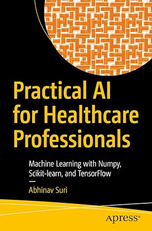

# Bildegjenkjenning Røntgen Lungebetennelse

Syke lunger eller friske lunger?

Røntgenbilder er lastet ned fra Kaggle.com. 

https://www.kaggle.com/code/amyjang/tensorflow-pneumonia-classification-on-x-rays

Programmet trener opp en modell til å skille mellom normale lunger og lunger med lungebetennelse. Her er det en del billedbehandling før modellen trenes. Treningen styres av flere parametre.

Teoretisk bakgrunn fra boken "Practical AI for Healthcare Professionals" (Abhinav Suri, 2022)
(Machine Learning with Numpy, Scikit-learn, and TensorFlow)

https://github.com/Apress/Practical-AI-for-Healthcare-Professionals/tree/main

