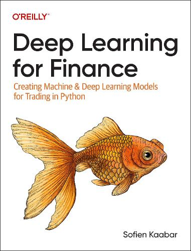

# Maskinlæring for Finans

Det er fristende å bruke maskinlæring for å handle aksjer. Men det er ikke så opplagt som man skulle tro.
Det krever mye arbeid for å lage modeller som har potensiale til å slå markedet.

Eksemplet/oppgaven henter aksjekurser til Equinor fra Yahoo Finance, og bruker en veldig enkel 
tidsserie-modell for å spå om kursen går opp eller ned.

Modellen bør naturlig nok utvides med mange flere type inndata enn aksjekursen.
Og modellen bør også gjøres mer avansert.
Det får bli senere.

Teoretisk bakgrunn fra boken "Deep Learning for Finance" (Sofien Kaabar, 2024).
(Creating Machine & Deep Learning Models for Trading in Python)

[https://github.com/asdfjkl/neural_network_chess](https://github.com/sofienkaabar/deep-learning-for-finance)

